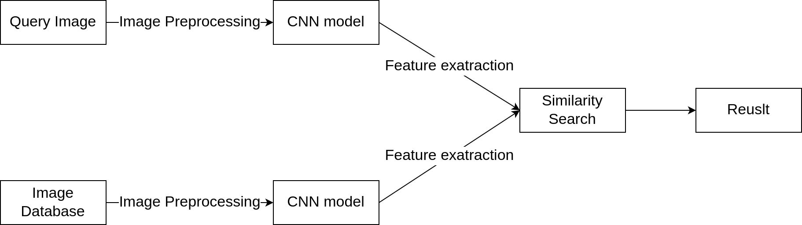

# Anime Search Engine

## Description

Search anime characters based on uploaded images. 
- Input: Image
- Output: Related anime with input image

## Pipeline
  

## Data Collection
Collect the information, character, image of 8000 most popular anime on [Myanimelist](https://myanimelist.net/)

Data: [Download](https://huggingface.co/datasets/huyhamhoc/popular_anime_character)

## Image Preprocessing
The preprocessing stage employs [YOLOv11](https://github.com/ultralytics/ultralytics) for face detection within images.

Data to train model: [Download](https://huggingface.co/datasets/deepghs/anime_head_detection)

## Feature Extraction
Facial feature embeddings are extracted using various CNN models. The models explored include:
- **Vision Transformer (ViT)**: using the [timm library](https://github.com/rwightman/pytorch-image-models), fine-tuned on my dataset.
- **FaceNet**: Utilized through the [facenet-pytorch](https://github.com/timesler/facenet-pytorch) library.
- **Fine-tuned FaceNet**: Using pre-trained FaceNet model, fine-tuned on my dataset.

## Similarity Search

The project employs [Faiss](https://github.com/facebookresearch/faiss) for efficient indexing and searching of facial embeddings. Faiss allows for fast retrieval of similar embeddings from a large dataset.

## API and User Interface
Backend: [FastAPI](https://fastapi.tiangolo.com/), processing and handling image uploads. 

User Interface: [Streamlit](https://streamlit.io/), enabling users to interactively upload images and view search results.
